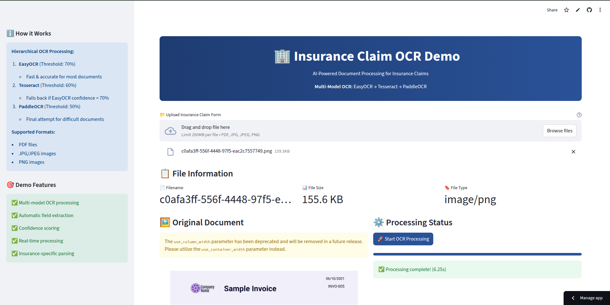

# Insurance Claim OCR Demo

AI-Powered document processing demo for insurance claim forms using hierarchical OCR approach with multiple models.

## Demo Video

[Watch Demo Video](https://www.youtube.com/watch?v=p6e7mIDovRU)

## Demo Screenshot



## Project Overview

This project demonstrates an intelligent OCR system that processes insurance claim forms using a multi-tiered approach:

1. **EasyOCR** (Primary - Threshold: 70%)
2. **Tesseract** (Fallback - Threshold: 60%)
3. **PaddleOCR** (Final attempt - Threshold: 50%)

The system automatically selects the best OCR method based on confidence scores and extracts key insurance information.

## Features

- **Multi-Model OCR Processing**: Hierarchical approach ensuring maximum accuracy
- **Insurance Field Extraction**: Automatic parsing of policy numbers, claim amounts, dates, etc.
- **Real-time Processing**: Fast document analysis with progress tracking
- **Interactive UI**: Clean, professional interface built with Streamlit
- **Export Options**: Download results as JSON or CSV
- **Confidence Scoring**: Visual confidence comparison between OCR methods

## Project Structure

```
insurance-ocr-demo/
├── app.py                 # Main Streamlit application
├── ocr_service.py         # Backend OCR processing service
├── requirements.txt       # Python dependencies
├── packages.txt          # System packages for Streamlit Cloud
├── Dockerfile            # Docker configuration
├── .streamlit/
│   └── config.toml       # Streamlit configuration
└── README.md             # This file
```

## Installation & Setup

### Method 1: Local Development

1. **Clone the repository** (or create files manually):
```bash
git clone git@github.com:KhaiBoiPho/OCR-Doc2Data.git
cd OCR-Doc2Data
```

2. **Create virtual environment**:
```bash
python -m venv venv
source venv/bin/activate  # On Windows: venv\Scripts\activate
```

3. **Install Python dependencies**:
```bash
pip install -r requirements.txt
```

4. **Install system dependencies** (Ubuntu/Debian):
```bash
sudo apt-get update
sudo apt-get install tesseract-ocr tesseract-ocr-eng
```

5. **Run the application**:
```bash
streamlit run app.py
```

### Method 2: Docker

1. **Build Docker image**:
```bash
docker build -t insurance-ocr-demo .
```

2. **Run container**:
```bash
docker run -p 8501:8501 insurance-ocr-demo
```

## Usage

1. **Upload Document**: 
   - Supported formats: JPG, JPEG, PNG
   - Maximum size: 200MB

2. **Process Document**:
   - Click "Start OCR Processing"
   - Watch real-time progress
   - View confidence scores for each OCR method

3. **Review Results**:
   - Extracted insurance fields
   - Raw text output
   - Confidence comparison chart
   - Processing time metrics

4. **Export Data**:
   - Download as JSON for system integration
   - Download as CSV for spreadsheet analysis

## Technical Details

### OCR Processing Pipeline

1. **Image Preprocessing**:
   - Grayscale conversion
   - Noise reduction
   - Adaptive thresholding

2. **Hierarchical OCR**:
   - **EasyOCR**: Fast, neural network-based
   - **Tesseract**: Traditional, highly configurable
   - **PaddleOCR**: Advanced, handles complex layouts

3. **Field Extraction**:
   - Regex patterns for insurance-specific fields
   - Policy numbers, claim amounts, dates, contact info

### Key Dependencies

- **Streamlit**: Web interface framework
- **OpenCV**: Image processing
- **EasyOCR**: Primary OCR engine
- **Tesseract**: Fallback OCR engine
- **PaddleOCR**: Final fallback OCR engine
- **Plotly**: Interactive charts

## Performance Metrics

The system tracks several performance indicators:
- **Processing Time**: End-to-end processing duration
- **Confidence Scores**: OCR accuracy for each method
- **Field Extraction Rate**: Percentage of insurance fields successfully identified
- **Method Selection**: Which OCR engine provided the best results

## Production Considerations

**Note**: This is a demo application. For production use, consider:
- Authentication and authorization
- Database integration for storing results
- API rate limiting
- Enhanced error handling
- Security scanning of uploaded files
- Scalability improvements

## Support

For technical questions or deployment issues:
- Check the [Streamlit documentation](https://docs.streamlit.io)
- Review [EasyOCR documentation](https://github.com/JaidedAI/EasyOCR)
- Open an issue in the GitHub repository

## License

This project is created for demonstration purposes as part of an AI Engineering Intern assignment.

---
